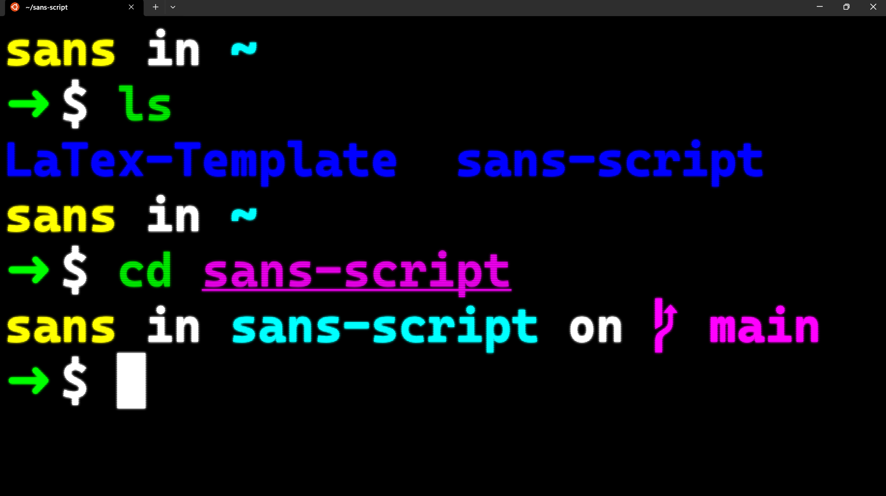

# Utilizando o WSL e Personalização do Terminal

Fig. 1: Olha QUE Legal :D

## Introdução

O Windows Subsystem for Linux (WSL) é uma ferramenta poderosa que permite aos usuários do Windows executar um ambiente Linux diretamente em seus sistemas operacionais Windows. Isso abre várias possibilidades, incluindo a personalização do terminal para uma experiência de desenvolvimento mais fluida e eficiente.

### Referência:
- LEARN MICROSOFT. Instalar o WSL. Disponível em: <https://learn.microsoft.com/pt-br/windows/wsl/install>. Acesso em: 8 de abr. de 2024.

## Oh My Zsh

Oh My Zsh é um framework de código aberto para gerenciar a configuração do Zsh, uma poderosa shell de linha de comando. Com Oh My Zsh, os usuários podem facilmente personalizar e aprimorar sua experiência no terminal com temas, plugins e outras configurações úteis.

### Referência:
- GODOY, E. G. ErickRock/oh-my-zsh-on-windows-terminal. Disponível em: <https://github.com/ErickRock/oh-my-zsh-on-windows-terminal>. Acesso em: 8 de abr. de 2024.

## Spaceship

Spaceship é um tema altamente personalizável para Oh My Zsh que oferece uma série de recursos úteis, como exibição de informações de sistema, git status e muito mais. Ele é projetado para ser altamente legível e informativo, tornando a navegação no terminal mais eficiente.

### Referência:
- Terminal com Oh My Zsh, Spaceship, Dracula e mais. Disponível em: <https://blog.rocketseat.com.br/terminal-com-oh-my-zsh-spaceship-dracula-e-mais/>. Acesso em: 8 de abr. de 2024.

## Plugins do ZSH com ZInit

Além de temas, Oh My Zsh suporta uma variedade de plugins que podem estender ainda mais a funcionalidade do Zsh. O ZInit é um gerenciador de plugins para Zsh que facilita a instalação e o gerenciamento de plugins. Isso permite aos usuários adicionar funcionalidades extras ao seu ambiente de terminal com facilidade.

### Referência:
- Terminal com Oh My Zsh, Spaceship, Dracula e mais. Disponível em: <https://blog.rocketseat.com.br/terminal-com-oh-my-zsh-spaceship-dracula-e-mais/>. Acesso em: 8 de abr. de 2024.

## Conclusão

A combinação do Windows Subsystem for Linux (WSL) com ferramentas como Oh My Zsh, Spaceship e Plugins do ZSH oferece aos usuários do Windows uma maneira poderosa de personalizar e aprimorar sua experiência de desenvolvimento no terminal. Essas ferramentas permitem uma produtividade aumentada e uma interface de usuário mais amigável, tornando o desenvolvimento no Windows mais agradável e eficiente.
